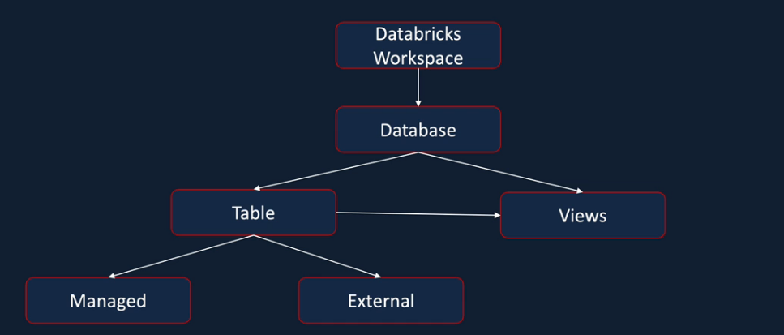

- Azure databricks is made up of 3 components
    - Apache Spark (open source)
    - Databricks (company created by founders of spark to make managing spark more easier)
    - Azure (which provides Databricks as a first party service)

- To use spark effectively, we need to spin up clusters, manage security, use 3rd party libraries etc. This is where Databricks comes in, it makes handling spark much more easier. We can spin up clusters for distributed computing with a few clicks. 

- Databricks also offers Spark runtime which is highly optimized and maybe 5x faster than Vanilla Apache Spark.

- All 3 major cloud providers - Azure, GCP, AWS has Databricks integration. But Azure is supposed to offer a deeper intergration and offers it as a first party service, also with unified billing and support. 

# Databricks Clusters

Cluster = collection of virtual machines with a driver node and worker nodes. 

With clusters we can treat the group of computers as a single compute engine via Driver node

Databricks offers 2 types of clusters
- all purpose
    - can be created manually
    - best for interactive, ad-hoc tasks
    - more expensive
    - is persistent
- job cluster
    - created when a job is run and terminated when it ends
    - can be created as part of the databricks workflow jobs
    - better for repeated production tasks
    - cheaper

Options for cluster configuration
- Single/Multi Node
- Access Mode: Single user/ shared access etc
- Databricks Runtime - Normal runtime, ML runtime, photon runtime, runtime light
- Auto termination - after how many minutes cluster should be shut down
- Auto scaling - specify min and max number of nodes
- Cluster VM Type/Size
- Cluster policy: Makes interface simpler as it restrics options according to various policies.

Cluster pools are used to reduce cluster setting up time. It has vms that are kept aside previously which can be allocated faster. Min and max number of vms are used.

# Databricks Notebooks
- Notebook - a collection of cells that run commands on a databricks cluster
- While creating a notebook, you need to attach it to a cluster where the commands can run
- One notebook can have multiple languages from python, scala, sql, R
- %md can be used for documenting in Markdown
- %fs & %sh are other magic commands that can be used for accessing the filesystem and shell
- few utilities that can used in notebooks
    - file system
    - secrets - vault etc
    - widget utilities - pass params to notebooks to make a notebook reusable
    - notebook workflow utilities - to chain different notebooks together and use one from the other
- dbutils package is quite helpful, you can access it from all languages like python, scala, R. And write code programmatically, for example, file system can be accessed by dbutils.fs
- for adhoc tasks we can use magic commands like %fs, but dbutils.fs can be used in jobs or when we're accessing fs methods from within a program.

# Azure Data Lake
Various forms of authentication available for Azure Data Lake
- session scoped: only for the duration of the session in a given notebook
- cluster scoped: at a cluster level, for any notebooks attached to the cluster
- Azure access directory (AAD) credential
- Unity catalog

Containers can be thought of as equivalent to folders/directories

### Authentication using access keys
- When accessing data in ADL from databricks, we need to give one of the 2 access keys to Databricks so it can read the data. This is done by setting up a spark configuration in databricks notebook
- ABFS driver is used to access data from ADL. use dbutils.fs
- access keys give full access, so this is not ideal in cases where we want to restrict access to certain users (eg give only read only access). This is when shared access signature tokens come into picture 

### Authenticate using Shared Access Signature (SAS) tokens
SAS tokens provide more fine grained access to your storage account wrt type of files, permissions, ip address, time period of access etc.


### Authenticate using Service Principle
- way to go for automated databricks jobs and ci/cd pipelines as they provide better security and monitoring
- also called Azure AD (Active Directory) application
- Microsoft entra id in azure portal, client id and tenant id needed from there
- steps to follow
    1. Register azure ad application
    2. Generate secret password for the application
    3. set spark config with client_id, client_secret, tenant_id
    4. Assign role 'storage blob data contributor' to data lake

All 3 above methods are session based authentication, we add keys within notebook

### Cluster based authentication
- when cluster is created, access to dl is secured, all notebooks connected to the cluster can access the dl
- we can edit spark config at the cluster level, add the access key and then restart the cluster

### AAD Credential Passthrough
- used in cases when different users require different levels of access

### Key Vault and Secret Scope
- Databricks Secret Scope + Azure Key Vault can be used to secure secrets
- Azure Key Vault -> Databricks Secret Scope -> Clusters/Notebooks/Jobs
- dbutils.secrets can be used in notebooks
- db secret scope url = homeurl/#secrets/createScope

### Databricks File System (DBFS) and Databricks Mounts
- DBFS: file system that provides distributed access to data stored in Azure storage.
- DBFS mount on default Azure Blob storage is called DBFS Root.
- you can upload files to DBFS filestore dir
- advantage of filesystem mount like this is that you can read directly using dbutils, without having to provide any authentication details
- to mount a DL to DBFS
    - get client keys/secrets using service principle
    - supply that as parameters and use dbutils.fs.mount


### Ingesting data
- inferSchema can be set to True and use that to read data, but then 2 spark jobs are created. First time to read the data and infer the schema and second time to actually read the data with the inferred schema. This is not a very efficient process and can slow down the pipeline, hence better to avoid inferSchema. Also if dataset has unexpected values, we want the processes to fail, inferschema may carry on with it even with wrong datatypes.

- structType can be thought of as representing a row and StructField as representing columns
- StructType is a collection of StructFields
- current_timestamp spark method can be used for adding time instead of datetime module

### Partition By
- The dataframe writer api has a partitionBy method. We can provide a col to it, which would then partition the data by that col, ie when it is stored to the disk, separate folders will be created for each of the distinct values in the given column.
- This helps with data parallelization, but you have to be careful in choosing the right col. For eg choosing a col that has only unique values per record would actually lead to a performance drop, so you have to strike the right balance.

### Schema Definition

- DDL style of defining schema
```
schema = "id STRING, marks INT"
```
- use HIVE datatypes
- Spark when reading json assumes its single line json by default, so for multi-line json you need to explicitly specify it. so set multiLine to True
- To read data split across multiple files into a single df, you can use spark.read as before, but instead of specifying the file name, give the directory name. You can also give wildcards like directory_name/some_patten_*.csv

### Databricks Workflows
- Use %run to use one notebook inside another
- can pass parameters to notebooks by using dbuitls.widgets. You can supply the parameter value during runtime
- dbutils.notebooks.run and dbutils.notebooks.exit can be used to chain notebooks together and execute them as a workflow using databricks jobs
- usually db workflows are not used in prodn env as they are very limited in capability and Azure Data Factory is used for the same.

### Spark Filter
- filter and where can be used interchangeably
- df.filter("year = 2015") => the sql way of doing. Use "and" to join conditions together like in sql
- df.filter(df["year"] == 2015) => the pythonic way of doing it. Here we can use &(and) |(or) etc to join conditions together 

### Spark Joins - Types
- Inner Join : default, tables from both
- Left Join = Left Outer Join, all values from left, null if those rows dont exist on right
- Right Join = Right Outer Join, all values from right, null if those rows dont exist on left
- Full Join = Full Outer Join = All values from both tables, null on either side if rows dont exist on the other table
- Cross Join = Cartesian product (can lead to oom frequently). resulting table count = count of table 1 * count of table 2. Every row from left table matched with every row from right table. Syntax is slightly different
```
a_cross_b = a.crossJoin(b)
```
- left semi join = think of product of inner join, but do a distinct and select columns only from the left
- left anti join = rows from left that dont have a match in the right
Ref: https://stackoverflow.com/questions/21738784/difference-between-inner-join-and-left-semi-join

### Aggregations
- Built in aggregate functions like count, count_distinct, sum etc can be used to return 1 single row of aggregate data (without using groupby)
- Eg df.select(count("*")) would return one row with the total count
- Multiple aggregations can be done together too, which would become different cols in a single row
- Eg: df.select(count("*"), sum("marks"))
- In most scenarios, we don't want just a single record. we want the count of each unique value in a col etc, this is where groupby comes into picture.
- df.groupBy(name) => this returns a groupedData object, on which aggregations can be performed. So we would have multiple rows with unique values from each col and the result of the corresponding aggregate function
- When doing aggregations on groupedData object, only one can be done at a time. However there's a method .agg(), using which we can perform multiple aggregations on a groupedData object
- when() can be used if you want to count only certain rows that satisfy a condition.

### Window Functions
```
studentsRankSpec = df.partitionBy("academic_year").orderBy("marks", ascending=False)
df = df.withColumn("rank", rank().over(studentsRankSpec))
```
Rank is an example of a window function, there are several other window functions that can be applied on a partition. Here, we separate the df into partitions based on year, then in each year we find the total marks in descending order and thus a window is created. On this window, we apply the rank function.

### Spark SQL
- To access a dataframe from SQL, there are 2 options - temporary view and global view
- Temp view only valid within a spark session
- To create a temp view, can either use createTempView or createOrReplaceTempView
- Eg: df.createTempView(df_view)
- Once the view is created, can be accessed using sql, from either sql directly (on a db notebook %sql) or through python using spark.sql()
- Global temp view is accessible from the entire application, ie from a databricks cluster
- global temp views can be created similarly using createOrReplaceGlobalTempView()
- To access in sql use global_temp.view
- To show available tables in databricks, you can use SHOW TABLES (for local) or SHOW TABLES IN global_temp (for global)
- Few useful spark SQL statements - SHOW, DESCRIBE, USE, current_database()
- Diff between managed table and external table ->
    - if you drop the table, data is also dropped in the case of managed, 
    - but for external even if table is dropped, data remains, just metadata is dropped.
- df.saveAsTable("table_name") (without specifying a path) would create a managed table, which can then be used for SQL processing
- df.option("path", "somepath").saveAsTable("table_name") would create an external table, since we specified the path
- A View is a visual representation on top of a Table
- Databricks notebook has some visualisation options which can be used to plot charts from a table & create dashboard option to combine these visualisations as well.


### Hive Meta Store

Spark SQL ----->  Hive Meta Store ------> Azure Data Lake

- Azure DL stores the actual data objects, Hive Meta Store helps spark sql access these by storing the metadata that enables spark sql to access this data as tables & columns. 
- Metadata can include things like location of the file, format of the columns etc
- Meta store is essentially a storage for the metadata about the data files
- There are few options for Hive Meta Store - Databricks default option or an external store like AzureSQL, MySQL etc
- Spark SQL uses the meta store to apply the schema and access the data



### Data Loading Patterns
- Full Load: When the entire data is provided by the source
- Incremental Load: When only the changes since the last load are provided by the source
- In real world projects, there could be a hybrid approach followed where we receive incremntal but process fully or vice versa.
- History File/Cutover File: The file that contains the entire historical data
- Delta File: File that contains only the new changes
- "append" mode can be used instead of "overwrite" in df.write scenarios
- Azure Data Lake doesnt have delta lake's merge capabilities, alter/drop partitions come in handy for incremental loads

